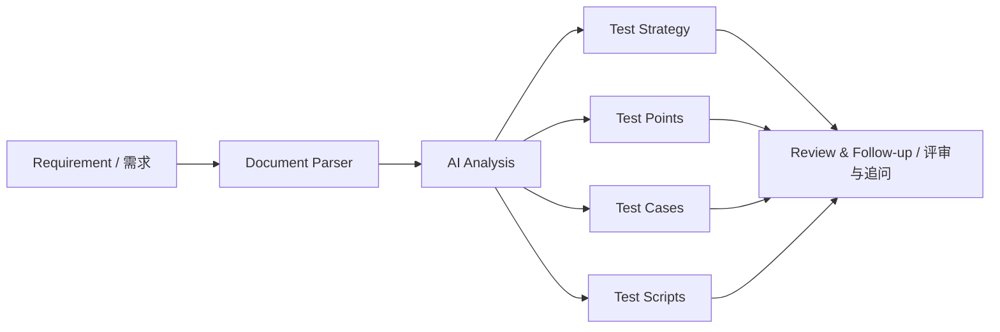

<div align="center">


# TestPilotAgent

**Turn requirement documents into structured test strategies, test points, cases and scripts with AI.**  
**把需求文档转成结构化测试策略、测试点、测试用例和测试脚本。**

[](https://nextjs.org)
[](https://fastapi.tiangolo.com)
[](#-roadmap--路线图)
[](./LICENSE)

</div>

---

## 🎯 What it is / 它是什么

**EN**  
TestPilotAgent is an AI-assisted testing workbench. Upload or paste a requirement, then turn it into reusable testing assets instead of starting every review from a blank page.

**中文**  
TestPilotAgent 是一个面向测试工程师的 AI 工作台。上传需求文档或直接粘贴需求后，它会把内容拆解成可复用的测试资产，而不是每次都从空白文档开始写。

> **From requirement → test strategy → test points → test cases → test scripts.**  
> **从需求 → 测试策略 → 测试点 → 测试用例 → 测试脚本。**

---

## 🎬 Demo / 演示

<div align="center">


</div>

> Next recommended asset: a short workflow GIF showing upload → generation → follow-up refinement.  
> 下一步建议补一段 10–20 秒 GIF：展示上传需求 → 生成 → 追问修改的完整闭环。

---

## ⚡ Quick Start / 5 分钟快速开始

### Backend / 后端

```bash
git clone https://github.com/Dream22180971/TestPilotAgent.git
cd TestPilotAgent/testpilot-api

pip install -r requirements.txt
./start-api.ps1
```

### Frontend / 前端

Open another terminal:

```bash
cd TestPilotAgent/testpilot-web

npm install
./start-web.ps1
```

Then open:

- Workbench / 工作台: `http://127.0.0.1:3000/workspace`
- API docs / 接口文档: `http://127.0.0.1:8000/docs`

### Optional model config / 可选模型配置

Create `testpilot-api/.env`:

```bash
DASHSCOPE_API_KEY="your-key"
```

No key? The project can fall back to its rule-based generation path.

没有 API Key 时，可以回退到规则引擎生成基础结果。

---

## ✨ Core workflow / 核心工作流



The key idea is not “AI writes everything automatically”. The key idea is **AI drafts structured test assets, humans review and refine**.

核心不是“让 AI 自动替代测试人员”，而是让 AI 先完成结构化初稿，人负责评审、补充和最终判断。

---

## 🧪 What it can generate / 当前可生成内容

| Output | EN | 中文 |
|---|---|---|
| Test strategy | scope, risks, approach | 测试范围、风险、方法 |
| Test points | functional and edge scenarios | 功能点与边界场景 |
| Test cases | structured reusable cases | 结构化可复用用例 |
| Test scripts | automation-oriented drafts | 自动化脚本草稿 |
| Follow-up refinement | regenerate or supplement | 追问补充或重新生成 |
| History | keep generated assets | 保存历史生成记录 |

Supported input documents currently include TXT, PDF and DOCX.

当前支持 TXT、PDF、DOCX 需求文档解析。

---

## 🧩 Example / 使用示例

Suppose the requirement says:

```text
The user can log in with username and password.
After five consecutive password failures, the account must be locked.
```

TestPilotAgent can help expand this into:

- normal login / 正常登录
- wrong password / 密码错误
- fifth failure / 第 5 次失败
- lock state / 锁定状态
- unlock path / 解锁路径
- boundary and retry behavior / 边界与重试行为

Then you can continue with a natural-language follow-up such as:

```text
补充密码为空、用户名不存在、锁定后再次登录的场景。
```

---

## 🏗 Architecture / 技术架构

```text
┌──────────────────────────────────┐
│ Frontend · Next.js              │
│ Workspace · History · Chat      │
├──────────────────────────────────┤
│ Backend · FastAPI               │
│ Parser · Routes · Validation    │
├──────────────────────────────────┤
│ AI Layer                         │
│ Qwen / structured generation    │
│ Rule fallback                   │
├──────────────────────────────────┤
│ Storage                          │
│ SQLite / PostgreSQL             │
└──────────────────────────────────┘
```

### Design principles / 设计原则

- Structured output before pretty prose / 优先结构化输出
- Human review before acceptance / 结果必须经过人工评审
- Reusable assets instead of one-off chat / 产出可复用资产，而不是一次性对话
- Gradual evolution toward AI quality engineering / 逐步演进到 AI 质量工程

---

## 🧠 Where this is going / 未来方向

TestPilotAgent is evolving from a “test-case generator” into a broader AI quality workbench.

它会从“测试用例生成器”逐步演进为更完整的 AI Quality Workbench。

Potential future modules:

- RAG evaluation / RAG 评测
- prompt regression / Prompt 回归
- agent trajectory testing / Agent 轨迹测试
- MCP contract testing / MCP 契约测试
- hallucination checks / 幻觉检查
- latency and cost comparison / 延迟与成本对比
- golden datasets / Golden Dataset
- CI quality gates / CI 质量门禁

---

## 🗺 Roadmap / 路线图

### L1 · Core workflow / 核心闭环

- [x] Document upload and parsing
- [x] LLM integration
- [x] Database persistence
- [ ] Pydantic structured output validation
- [ ] Follow-up and partial regeneration
- [ ] Excel / XMind export
- [ ] Multi-model support
- [ ] Weekly dogfooding

### L2 · Knowledge / 知识沉淀

- [ ] Historical case RAG
- [ ] Project-specific memory
- [ ] Reusable test asset library

### L3 · Agentic QA / 多 Agent 协作

- [ ] Review agent
- [ ] Execution agent
- [ ] Archive agent
- [ ] Orchestration

### L4 · AI Quality Platform / AI 质量平台

- [ ] RAG evaluation
- [ ] Agent regression
- [ ] MCP quality gate
- [ ] Prompt regression
- [ ] Cost / latency observability

---

## 🔐 Current limitations / 当前限制

- This is not yet a production-grade enterprise test management system.
- Generated content still requires human review.
- Complex PDFs and image-heavy documents may need better multimodal parsing.
- Model quality depends on provider and prompt configuration.

- 当前还不是生产级企业测试管理平台。
- 所有 AI 结果仍需要人工评审。
- 复杂 PDF、图文混排文档仍需增强多模态解析。
- 结果质量会受到模型与提示词配置影响。

---

## 🤝 Contributing / 参与贡献

Useful contributions include:

- parsers
- structured schemas
- evaluation datasets
- export formats
- model adapters
- QA workflow ideas

尤其欢迎文档解析、结构化 Schema、评测数据集、导出格式、模型适配和真实测试工作流相关 PR。

---

## 📄 License

[MIT](./LICENSE)

<div align="center">

**AI should reduce repetitive test design work, not remove human judgment.**  
**AI 应该减少重复测试设计工作，而不是替代测试人员的判断。**

</div>
