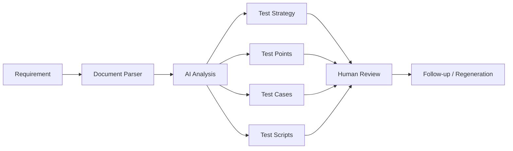

<div align="center">

# TestPilotAgent

**Turn requirement documents into structured test strategies, test points, cases and scripts with AI.**

[English](./README.md) | [简体中文](./README.zh-CN.md)

[](https://nextjs.org)
[](https://fastapi.tiangolo.com)
[](#roadmap)
[](./LICENSE)

</div>

---

## What it is

TestPilotAgent is an AI-assisted testing workbench. Upload or paste a requirement and turn it into reusable testing assets instead of starting every review from a blank page.

> **Requirement → test strategy → test points → test cases → test scripts → human review.**

The goal is not to remove human judgment. It is to reduce repetitive test-design work and give reviewers a structured first draft.

---

## Demo

<div align="center">


</div>

> Next visual asset: a short GIF showing upload → generation → follow-up refinement.

---

## Quick Start

### 1. Backend

```bash
git clone https://github.com/Dream22180971/TestPilotAgent.git
cd TestPilotAgent/testpilot-api

pip install -r requirements.txt
uvicorn app.main:app --reload --port 8000
```

The backend uses SQLite by default, so PostgreSQL is not required for a local first run.

Optional AI configuration:

```bash
cp .env.example .env
# then set DASHSCOPE_API_KEY in .env
```

### 2. Frontend

Open another terminal:

```bash
cd TestPilotAgent/testpilot-web

npm install
npm run dev
```

Open:

- Frontend: `http://127.0.0.1:3000`
- API docs: `http://127.0.0.1:8000/docs`
- Health check: `http://127.0.0.1:8000/health`

---

## Core Workflow



---

## Current Capabilities

| Capability | Status | Notes |
|---|---:|---|
| Requirement text input | ✅ | paste directly into the workspace |
| TXT / PDF / DOCX parsing | ✅ | document content is extracted for analysis |
| AI-assisted generation | ✅ | DashScope-compatible model integration |
| Rule fallback | ✅ | basic generation path without an API key |
| Project persistence | ✅ | SQLite by default, PostgreSQL supported through `DATABASE_URL` |
| Follow-up refinement | 🚧 | still evolving |
| Structured schema validation | 🚧 | planned with Pydantic |
| Excel / XMind export | 🚧 | planned |

---

## Example

Given a requirement:

```text
Users can log in with username and password.
After five consecutive password failures, the account must be locked.
```

A useful testing breakdown includes:

- normal login
- wrong password
- fifth failure
- locked account behavior
- retry behavior
- unlock path
- empty credentials
- nonexistent username
- boundary conditions

Then continue with a follow-up prompt such as:

```text
Add empty-password, nonexistent-user and login-after-lock scenarios.
```

---

## Architecture

```text
┌──────────────────────────────────┐
│ Frontend · Next.js 14           │
│ Workspace · History · Chat      │
├──────────────────────────────────┤
│ Backend · FastAPI               │
│ Parser · Routes · Export        │
├──────────────────────────────────┤
│ AI Layer                         │
│ DashScope-compatible model      │
│ Rule fallback                   │
├──────────────────────────────────┤
│ Storage                          │
│ SQLite by default               │
│ PostgreSQL via DATABASE_URL     │
└──────────────────────────────────┘
```

Design principles:

- structured output before polished prose
- human review before acceptance
- reusable test assets instead of one-off chat
- gradual evolution toward AI quality engineering

---

## Environment

Backend `.env` example:

```bash
DASHSCOPE_API_KEY=""
DATABASE_URL="sqlite:///./testpilot.db"
```

Optional model and endpoint overrides are documented in `testpilot-api/.env.example`.

---

## Current Limitations

- Generated content still requires human review.
- Complex image-heavy documents need stronger multimodal parsing.
- Output quality depends on the configured model and prompt.
- This is not yet a production-grade enterprise test management platform.

Making limitations explicit is intentional: this repository is a working engineering project, not a finished SaaS claim.

---

## Roadmap

### L1 · Reliable Core Workflow

- [x] Document upload and parsing
- [x] LLM integration
- [x] Persistent database
- [ ] Pydantic structured output validation
- [ ] Follow-up and partial regeneration
- [ ] Excel / XMind export
- [ ] Multi-model support
- [ ] Regular dogfooding

### L2 · Knowledge

- [ ] Historical-case RAG
- [ ] Project-specific memory
- [ ] Reusable test asset library

### L3 · Agentic QA

- [ ] Review Agent
- [ ] Execution Agent
- [ ] Archive Agent
- [ ] Multi-agent orchestration

### L4 · AI Quality Workbench

- [ ] RAG evaluation
- [ ] Prompt regression
- [ ] Agent trajectory testing
- [ ] MCP contract testing
- [ ] Hallucination checks
- [ ] Latency / cost comparison
- [ ] Golden datasets
- [ ] CI quality gates

---

## Contributing

Useful contributions include:

- document parsers
- structured schemas
- evaluation datasets
- export formats
- model adapters
- real QA workflow examples

---

## License

[MIT](./LICENSE)

<div align="center">

**AI should reduce repetitive test-design work, not remove human judgment.**

</div>
