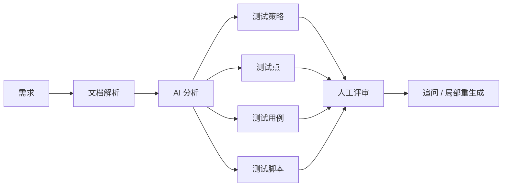

<div align="center">

# TestPilotAgent

**把需求文档转成结构化测试策略、测试点、测试用例和测试脚本。**

[English](./README.md) | [简体中文](./README.zh-CN.md)

[](https://nextjs.org)
[](https://fastapi.tiangolo.com)
[](#路线图)
[](./LICENSE)

</div>

---

## 🎯 它是什么

TestPilotAgent 是一个面向测试工程师的 AI 工作台。上传需求文档或直接粘贴需求后，把内容拆解成可复用的测试资产，而不是每次都从空白文档开始写。

> **需求 → 测试策略 → 测试点 → 测试用例 → 测试脚本 → 人工评审。**

目标不是替代测试人员的判断，而是减少重复的测试设计工作，让评审从一份结构化初稿开始。

---

## 🎬 演示

<div align="center">


</div>

> 下一步最值得补的是一段 GIF：展示上传需求 → 生成 → 追问补充的完整闭环。

---

## ⚡ 5 分钟快速开始

### 1. 启动后端

```bash
git clone https://github.com/Dream22180971/TestPilotAgent.git
cd TestPilotAgent/testpilot-api

pip install -r requirements.txt
uvicorn app.main:app --reload --port 8000
```

后端默认使用 SQLite，本地首次启动不要求 PostgreSQL。

可选 AI 配置：

```bash
cp .env.example .env
# 然后在 .env 中设置 DASHSCOPE_API_KEY
```

### 2. 启动前端

另开一个终端：

```bash
cd TestPilotAgent/testpilot-web

npm install
npm run dev
```

访问：

- 前端：`http://127.0.0.1:3000`
- API 文档：`http://127.0.0.1:8000/docs`
- 健康检查：`http://127.0.0.1:8000/health`

---

## 核心工作流



---

## ✅ 当前能力

| 能力 | 状态 | 说明 |
|---|---:|---|
| 直接输入需求 | ✅ | 在工作台粘贴需求 |
| TXT / PDF / DOCX 解析 | ✅ | 自动提取文档内容 |
| AI 辅助生成 | ✅ | 对接 DashScope 兼容模型 |
| 规则兜底 | ✅ | 没有 API Key 时可走基础生成路径 |
| 项目持久化 | ✅ | 默认 SQLite，也支持 `DATABASE_URL` 切 PostgreSQL |
| 追问修改 | 🚧 | 持续完善 |
| 结构化 Schema 校验 | 🚧 | 计划使用 Pydantic |
| Excel / XMind 导出 | 🚧 | 规划中 |

---

## 使用示例

假设需求是：

```text
用户可以通过用户名和密码登录。
连续 5 次密码错误后，账号必须锁定。
```

测试拆解至少应该覆盖：

- 正常登录
- 密码错误
- 第 5 次失败
- 锁定后的行为
- 重试行为
- 解锁路径
- 空用户名 / 空密码
- 用户不存在
- 边界条件

随后可以继续追问：

```text
补充密码为空、用户名不存在、锁定后再次登录的场景。
```

---

## 🧩 技术架构

```text
┌──────────────────────────────────┐
│ Frontend · Next.js 14           │
│ Workspace · History · Chat      │
├──────────────────────────────────┤
│ Backend · FastAPI               │
│ Parser · Routes · Export        │
├──────────────────────────────────┤
│ AI Layer                         │
│ DashScope-compatible model      │
│ Rule fallback                   │
├──────────────────────────────────┤
│ Storage                          │
│ 默认 SQLite                     │
│ DATABASE_URL 可切 PostgreSQL    │
└──────────────────────────────────┘
```

设计原则：

- 优先结构化输出，而不是漂亮但不可复用的长文本
- 所有 AI 结果都要经过人工评审
- 产出测试资产，而不是一次性聊天内容
- 从测试设计逐步演进到 AI 质量工程

---

## 环境变量

后端 `.env` 示例：

```bash
DASHSCOPE_API_KEY=""
DATABASE_URL="sqlite:///./testpilot.db"
```

模型和 Endpoint 的可选覆盖项见 `testpilot-api/.env.example`。

---

## ⚠️ 当前限制

- AI 生成结果仍然需要人工评审。
- 图文混排和复杂扫描文档仍需要更强的多模态解析。
- 输出质量会受到模型与提示词配置影响。
- 当前还不是生产级企业测试管理平台。

明确写限制是有意为之：这个仓库展示的是一个真实演进中的工程项目，而不是包装成“已经完成的 SaaS”。

---

## 🗺 路线图

### L1 · 核心闭环可靠化

- [x] 文档上传与解析
- [x] 大模型集成
- [x] 数据持久化
- [ ] Pydantic 结构化输出校验
- [ ] 追问与局部重生成
- [ ] Excel / XMind 导出
- [ ] 多模型支持
- [ ] 持续 Dogfooding

### L2 · 知识沉淀

- [ ] 历史用例 RAG
- [ ] 项目级记忆
- [ ] 可复用测试资产库

### L3 · Agentic QA

- [ ] 评审 Agent
- [ ] 执行 Agent
- [ ] 归档 Agent
- [ ] 多 Agent 编排

### L4 · AI Quality Workbench

- [ ] RAG 评测
- [ ] Prompt 回归
- [ ] Agent 轨迹测试
- [ ] MCP 契约测试
- [ ] 幻觉检查
- [ ] 延迟 / 成本对比
- [ ] Golden Dataset
- [ ] CI 质量门禁

---

## 🤝 参与贡献

尤其欢迎：

- 文档解析器
- 结构化 Schema
- 评测数据集
- 导出格式
- 模型适配
- 真实 QA 工作流案例

---

## License

[MIT](./LICENSE)

<div align="center">

**AI 应该减少重复测试设计工作，而不是替代测试人员的判断。**

</div>
